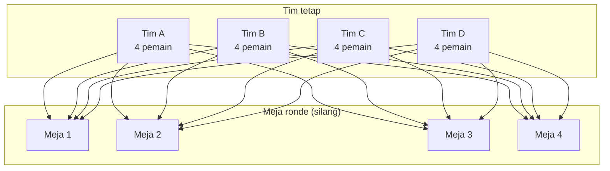
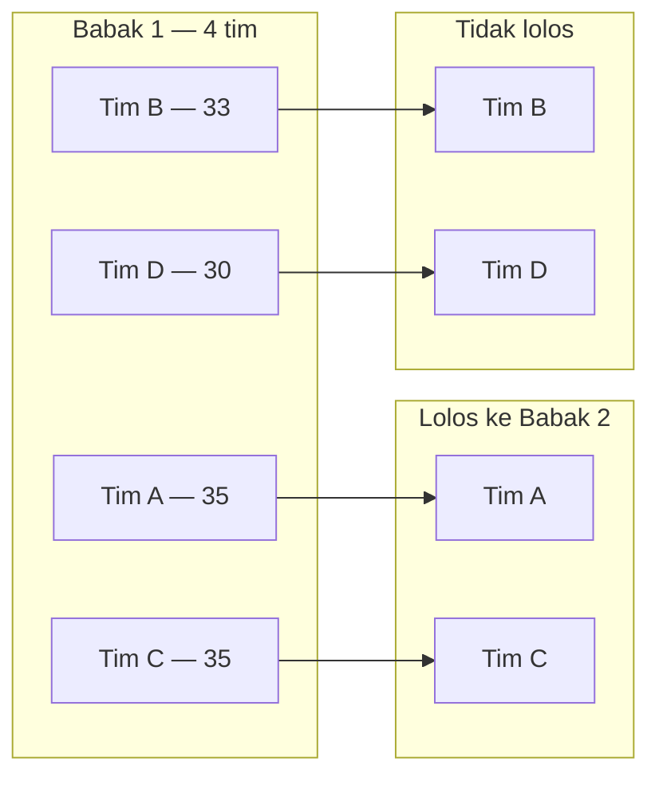
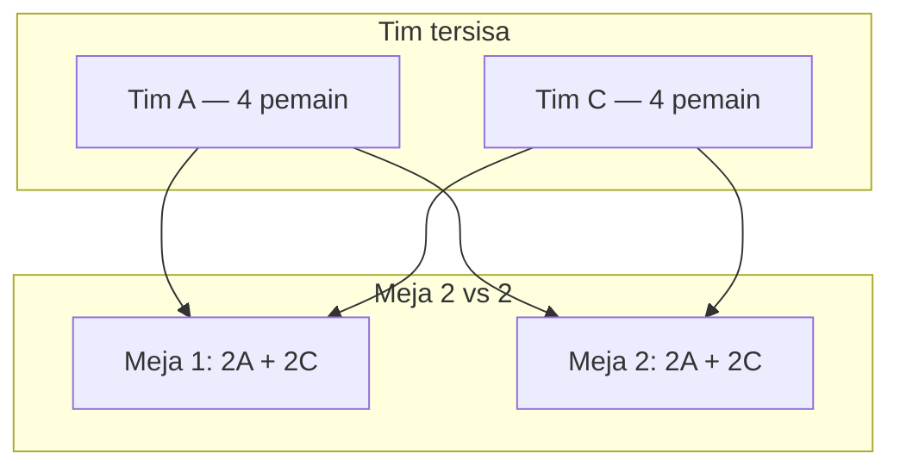
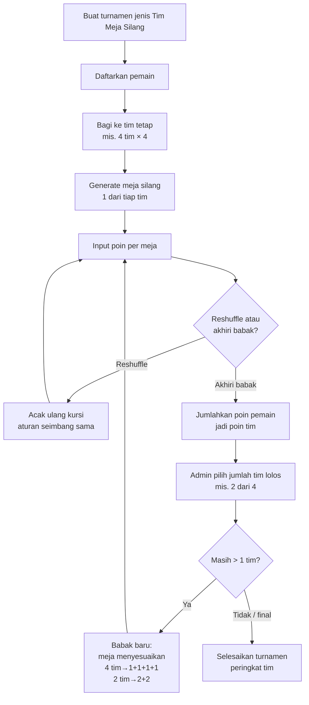

# Alur Turnamen Tim (Meja Silang)

Dokumen ini menggambarkan format turnamen baru yang diusulkan: **tim tetap**, **meja silang antar tim**, **acak ulang kursi tiap reshuffle**, lalu **lolos per tim**.

Berbeda dari Mahjong saat ini (grup = meja, yang lolos = pemain), di format ini:

| Konsep | Arti |
|--------|------|
| **Tim / grup** | Skuad tetap (mis. 4 pemain) |
| **Meja** | Tempat main 4 orang dari tim berbeda |
| **Babak** | Tahap kompetisi (mis. 4 tim → 2 tim → final) |
| **Ronde / reshuffle** | Pengacakan ulang kursi di babak yang sama |

---

## Ringkasan aturan

1. Ada beberapa **tim** dengan jumlah pemain sama (contoh: 4 tim × 4 pemain = 16 orang).
2. Setiap **ronde**, pemain didudukkan ke meja dengan aturan: **satu meja tidak boleh berisi 2 pemain dari tim yang sama** selama jumlah tim = ukuran meja (4 tim → 1 dari tiap tim per meja).
3. **Reshuffle**: kursi diacak lagi, tim tetap, aturan seimbang tetap berlaku.
4. Poin tiap pemain dijumlahkan menjadi **poin tim**.
5. Admin mengakhiri babak dan memilih berapa **tim** yang lolos.
6. Babak berikutnya: tim yang lolos tetap utuh; komposisi meja menyesuaikan (mis. 2 tim → **2 vs 2** di tiap meja).

---

## Contoh setup awal

```
16 pemain → 4 tim (A, B, C, D) × 4 pemain

Tim A: A1 A2 A3 A4
Tim B: B1 B2 B3 B4
Tim C: C1 C2 C3 C4
Tim D: D1 D2 D3 D4
```

---

## Babak 1 — 4 tim (komposisi meja: 1+1+1+1)

### Struktur babak



### Contoh isi meja (ronde 1)

Setiap meja: **1 pemain dari tiap tim**.

```
┌─────────────┬─────────────┐
│   Meja 1    │   Meja 2    │
│ A1 B2 C3 D4 │ A2 B3 C4 D1 │
├─────────────┼─────────────┤
│   Meja 3    │   Meja 4    │
│ A3 B4 C1 D2 │ A4 B1 C2 D3 │
└─────────────┴─────────────┘

Aturan: tidak ada meja yang berisi 2 pemain dari tim yang sama.
```

### Reshuffle (ronde berikutnya, babak sama)

Tim **tidak berubah**. Hanya kursi yang diacak ulang, tetap 1 dari tiap tim per meja.

```
Ronde 1                         Ronde 2 (setelah reshuffle)
┌──────┐ ┌──────┐               ┌──────┐ ┌──────┐
│A1 B2 │ │A2 B3 │               │A3 B1 │ │A1 B4 │
│C3 D4 │ │C4 D1 │      →        │C2 D3 │ │C1 D2 │
└──────┘ └──────┘               └──────┘ └──────┘
┌──────┐ ┌──────┐               ┌──────┐ ┌──────┐
│A3 B4 │ │A4 B1 │               │A2 B3 │ │A4 B2 │
│C1 D2 │ │C2 D3 │               │C4 D1 │ │C3 D4 │
└──────┘ └──────┘               └──────┘ └──────┘
```

### Skor → poin tim

```
Poin pemain (contoh setelah beberapa ronde)
  A1=12  A2=8   A3=5   A4=10   →  Tim A = 35
  B1=9   B2=11  B3=7   B4=6    →  Tim B = 33
  C1=14  C2=4   C3=9   C4=8    →  Tim C = 35
  D1=3   D2=10  D3=12  D4=5    →  Tim D = 30
```

Ranking babak berdasarkan **total poin tim** (bukan peringkat individu untuk lolos).

---

## Akhiri babak — lolos per tim

Admin memilih berapa tim yang lanjut, misalnya **2 dari 4**.



- Pemain Tim A & Tim C tetap di skuad masing-masing (4 orang).
- Tim B & Tim D keluar dari kompetisi aktif.

Jika dua tim seri di batas lolos, admin bisa memilih manual (mirip tiebreak Mahjong).

---

## Babak 2 — 2 tim (komposisi meja: 2+2)

Dengan hanya 2 tim, aturan “1 dari tiap tim” di meja 4 kursi tidak lagi cukup.  
Komposisi menjadi **2 vs 2**: tiap meja berisi **2 pemain Tim A + 2 pemain Tim C**.

```
8 pemain tersisa → 2 meja × 4 kursi

Contoh ronde:
┌──────────────────┬──────────────────┐
│      Meja 1      │      Meja 2      │
│ A1 A3  |  C2 C4  │ A2 A4  |  C1 C3  │
│   (2)      (2)   │   (2)      (2)   │
└──────────────────┴──────────────────┘

Tidak boleh: 3 dari A + 1 dari C di meja yang sama.
```

Reshuffle di babak ini tetap mengacak pasangan kursi, dengan keseimbangan **2+2**.



Setelah babak selesai, admin lagi-lagi memilih berapa tim lolos (mis. **1 dari 2** = juara, atau lanjut ke final formal).

---

## Alur admin end-to-end



---

## Perbandingan singkat dengan Mahjong saat ini

```
Mahjong sekarang                    Tim meja silang (usulan)
─────────────────                   ─────────────────────────
Grup = meja main                    Tim = skuad tetap
                                    Meja = seating terpisah

Reshuffle = bagi ulang semua        Reshuffle = acak kursi saja
pemain ke meja baru                 (tim tidak berubah)

Lolos = N pemain terbaik            Lolos = N tim terbaik
(total / per grup meja)             (poin agregat tim)

Babak lanjut = pool pemain baru     Babak lanjut = skuad tim
lalu meja 4 orang lagi              yang lolos, komposisi meja
                                    menyesuaikan (1+1+1+1 → 2+2)
```

---

## Aturan komposisi meja (usulan umum)

Untuk meja berukuran **4 kursi**:

| Jumlah tim aktif | Pemain per tim | Isi tiap meja | Jumlah meja |
|------------------|----------------|---------------|-------------|
| 4 | 4 | 1+1+1+1 | 4 |
| 2 | 4 | 2+2 | 2 |
| 1 | 4 | 4 (final internal / penentuan juara individu — *opsional, perlu diputuskan*) | 1 |

Prinsip: **isi meja seimbang dari tiap tim yang masih aktif**, tanpa melebihi kuota per tim di satu meja.

---

## Poin yang sudah diputuskan

1. **Poin menumpuk dalam satu babak** lintas ronde (reshuffle tidak mereset poin).
2. **Poin di-reset saat ganti babak** (tim yang lolos mulai dari 0 di babak baru).
3. Seri di batas lolos tim → **pilih manual** oleh admin.
4. Saat tinggal **1 tim juara** → crowning tim saja, **tanpa peringkat individu**.
5. v1 mendukung start **4 atau 8 tim** (alur menuju 1 juara).

---

## Kesimpulan

Format ini diimplementasikan sebagai jenis turnamen baru `mahjong_team` (**Mahjong Tim**), dengan dua lapisan data: **tim** (`grup`) dan **meja** (`turnamen_meja` + seats), plus aturan seating dan advance berbasis tim.
